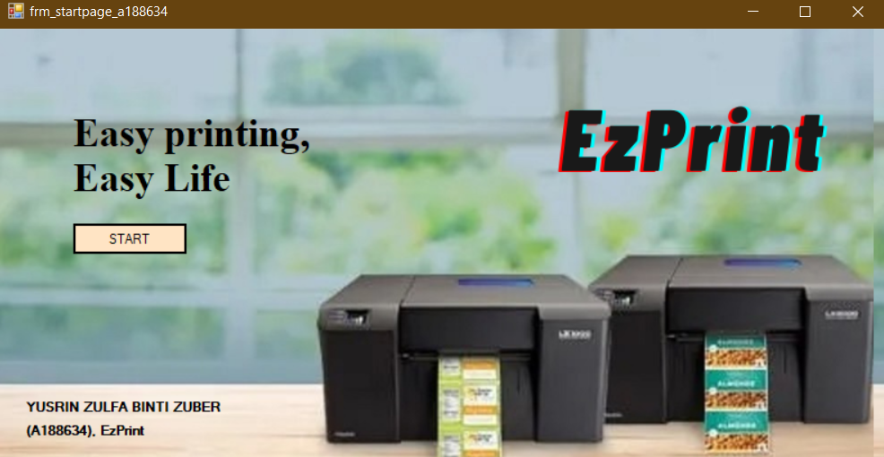
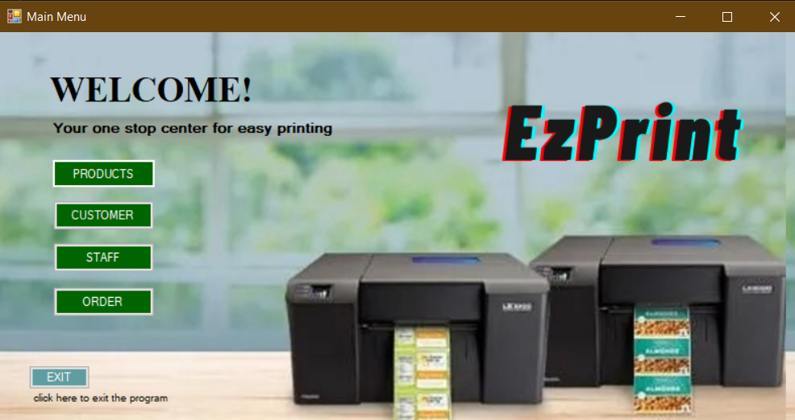

# Print Shop Database Management System

A dbms system built for assignment project for course TU2983 Advanced Database. The Print Shop DBMS was given the name EzPrint. It is a desktop application which aims at computerization of the current procedure of managing a print shop. This includes adding, removing and checking staff, items and customers as well as placing and checking an order.

Tools:
VB.net, .Net Framework, SQL, Microsoft Access
